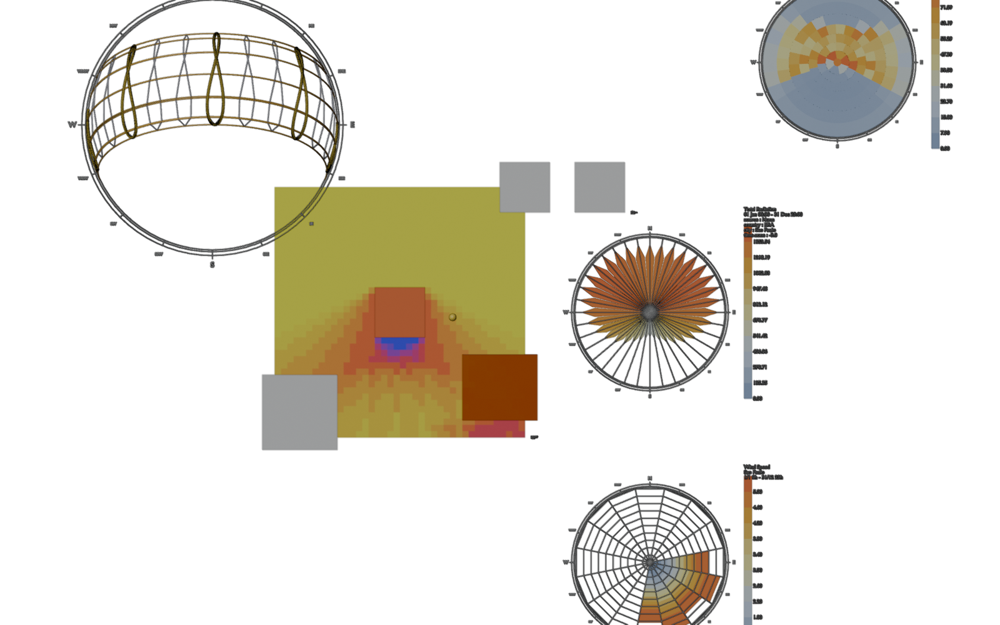

# Ladybug Tools for Blender

Sun path, direct sun hours, incident solar radiation and climate graphics
inside Blender 4.2+ / 5.x, packaged as a Blender **Extension**. A port of the
[Ladybug Tools](https://www.ladybug.tools/) workflows, with no Radiance,
Rhino or Grasshopper required.

*Português: [README.pt-BR.md](README.pt-BR.md) · guia de análise: [docs/GUIA.md](docs/GUIA.md)*



## How it works

The pure-Python Ladybug libraries (`ladybug-core`, `ladybug-geometry`,
`ladybug-radiance`, `ladybug-comfort`, `ladybug-display`) are bundled as
wheels and used as they are: sun path, EPW parsing, legends, color sets,
wind/radiation roses and sky domes are the original Ladybug code. The two
pieces that depend on Radiance binaries were re-implemented natively:

| Radiance | Native replacement |
|---|---|
| `gendaymtx` (sky matrix) | `core/skymatrix.py`: Perez all-weather sky in numpy, direct sun distributed to the 3 nearest patches with gendaymtx's weights |
| `rcontrib` (sky × sensor visibility) | `core/intersect.py`: ray casting with Blender's `mathutils.bvhtree` |

This is a radiation engine **without inter-reflection**: right for incident
radiation, direct sun hours and sky view; not for daylighting with bounces.

## Features

Sidebar (N) → **Ladybug** tab in the 3D Viewport:

- **Weather & Location**: load an EPW, or type latitude / longitude / time zone; north angle.
- **Analysis Period**: start/end month, day, hour; timestep; one-click presets
  (year, seasons, solstices, equinox, hemisphere-aware).
- **Sun Path**: hourly analemmas, day arcs for the 21st of each month, compass,
  sun points; a real Sun light aimed for a date/time; one-day animation.
- **Solar Studies**, in batch on all selected meshes, each shading the others:
  - *Direct Sun Hours* per face (or vertex).
  - *Incident Radiation* (kWh/m²) or average irradiance (W/m²), Perez sky from
    the EPW or ASHRAE clear sky, Tregenza (145) or Reinhart (577) patches.
  - *Sensor Grid*: adds a Remesh modifier tuned to a target cell size
    (Subdivision for open surfaces).
  - Results never touch the source objects: each study bakes a result copy,
    offset along the normals, into `LB Results / <object> (LB) / <object> · <study>`
    with one shared scale and one legend per batch, and metadata as custom
    properties. *Show* filter, *Rebuild Legend*, *Clear* buttons.
- **Period Explorer**: the visibility matrix of every result is cached, so a
  new year / month / day / hour range is a matrix product. Drag the sliders
  and the colors update without ray tracing.
- **Climate Graphics** at the 3D cursor: Sky Dome (3D or projected),
  Radiation Rose, Wind Rose (speed, temperature or humidity).
- **Legend**: Ladybug color sets, custom range, segment count, size,
  position and orientation.

## Install

Download `ladybug_tools-<version>.zip` from the releases (or build it, below)
and use *Edit > Preferences > Get Extensions > Install from Disk*. Blender
4.2 or newer; tested on 4.5 LTS, 5.1 and 5.2 LTS on Windows. EPW files:
<https://climate.onebuilding.org/> or <https://energyplus.net/weather>.

To build from source (Windows PowerShell; edit the Blender path in `build.ps1`
or pass `-Blender`):

```powershell
.\build.ps1            # validates and writes dist\ladybug_tools-<version>.zip
.\build.ps1 -Install   # ...and installs it into that Blender's user repository
```

## Quick start

1. Load the EPW of your city and click **Draw Sun Path**.
2. Draw the **Sky Dome** and the **Radiation Rose** to see where the energy comes from.
3. Select the roofs and facades, optionally **Add Grid** at 0.5 m, set the
   period, click **Direct Sun Hours** or **Incident Radiation**.
4. Open the **Period Explorer** and drag the month slider.

Conventions: Blender units are meters; +Y is north (Ladybug convention:
counterclockwise degrees from +Y, 90 = west). Daylight saving time is never
applied. Values live on the result copies as mesh attributes
(`LB Sun Hours`, `LB Radiation`, colors in `LB Color`).

## Validation

The native sky matrix was compared patch by patch with Radiance 6.0's
`gendaymtx` (`tests/validate_radiance.py`, reference values stored in
`tests/fixtures/`), on a clear-sky year, a clear-sky June, a cloudy year and
the Reinhart dome:

| Case | Patch correlation | Total radiation | Unobstructed surfaces (N, E, S, W, horizontal, 30° tilt) |
|---|---|---|---|
| clear-sky annual, Tregenza | 0.997 | +0.13 % | within 1.5 % |
| clear-sky annual, Reinhart | 0.988 | +0.06 % | within 1.3 % |
| clear-sky June | 0.993 | +0.06 % | within 0.9 % |
| cloudy annual (Zhang-Huang) | 0.998 | +0.32 % | within 0.9 % |

The diffuse component matches to 0.1 % per patch; the direct component
differs only in how the sun is spread over the nearest patches (gendaymtx
lights up to four, this port three), which averages out on any surface.

The BVH ray casting was compared with Radiance's `oconv` + `rcontrib`
(`tests/validate_rcontrib.py`) on the test scene (1600 ground sensors shaded
by a tower and a tilted roof): direct sun hours agree on 100 % of the rays
for June 21 and December 21; annual incident radiation differs by 0.02 % of
the maximum on average and 1.6 % at worst (sensors on patch boundaries).

`tests/test_skymatrix.py` checks energy conservation against the Wea and the
stored gendaymtx reference without needing Radiance; `tests/test_headless.py`
checks the ground sun hours against the stored rcontrib reference. `tests/test_headless.py`
runs every operator in background mode on a synthetic scene and checks
physical plausibility (southern hemisphere: north facade > south facade,
tower shadow on the ground, shared scales, caching).

Note for ladybug-radiance users: Radiance 6.0's `gendaymtx` writes an extra
`LATLONG=` header line, and `ladybug_radiance.SkyMatrix` 0.2.x skips a fixed
number of header lines, so with 6.0 binaries its patches come out shifted by
one (the ground patch becomes patch 0). This port does not use that parser.

Performance on a 2500-face grid with 5 context blocks (Blender 5.x, one core):
annual direct sun hours 5 s, annual radiation 0.8 s, sky matrix 0.4 s,
Period Explorer recolor 0.1 s.

## Roadmap

See [docs/ROADMAP.md](docs/ROADMAP.md): validation against Radiance, 2D
climate charts, a Blender/IFC → Honeybee model bridge (HBJSON export),
Honeybee-Energy through the EnergyPlus Python API, optional Radiance and a
Cycles-based daylight experiment.

## Known issues

- Another add-on that reloads numpy in-process (the legacy DeepBump does)
  breaks array *method* reductions for every add-on. This one only uses
  module-level numpy functions and keeps working, but others may not.
- The visibility cache is saved on each result object (uncheck *Save Cache in
  File* to keep .blend files small); results made before 0.4.1 have no cache.

## License

AGPL-3.0-or-later, inherited from the Ladybug Tools libraries. See
[LICENSE](LICENSE). Ladybug Tools is © Ladybug Tools LLC.
